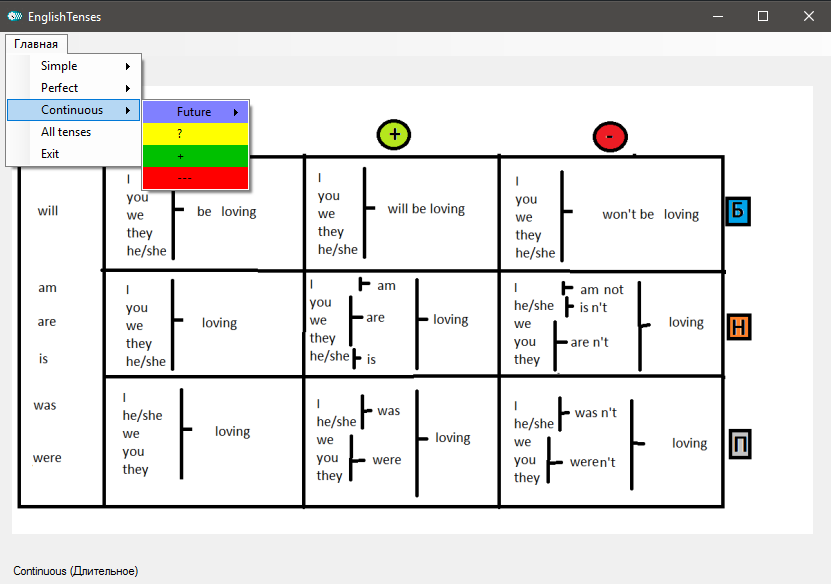

***

---

## About the project:

_EnglishTenses - this project has all the major tenses in English in tabular form. The tables are compiled according to the method of Dmitry Petrov._

---

## Why the application was created:

_I am learning English, I started to learn from the lessons of Dmitry Petrov. these lessons gave me a good start for further learning, and then I ran into the problem that the tables on the Internet were not convenient, and I decided to make a program that would display all the tenses correctly for me. If someone is learning English by Dmitry Petrov's method, you can use this application. By the way, the lessons are on YouTube (lessons in Russian)_

https://www.youtube.com/watch?v=8sNV6NvgAgY&list=PL66DIGaegedqtRaxfVsk6vH5dBDuL5w92

___
